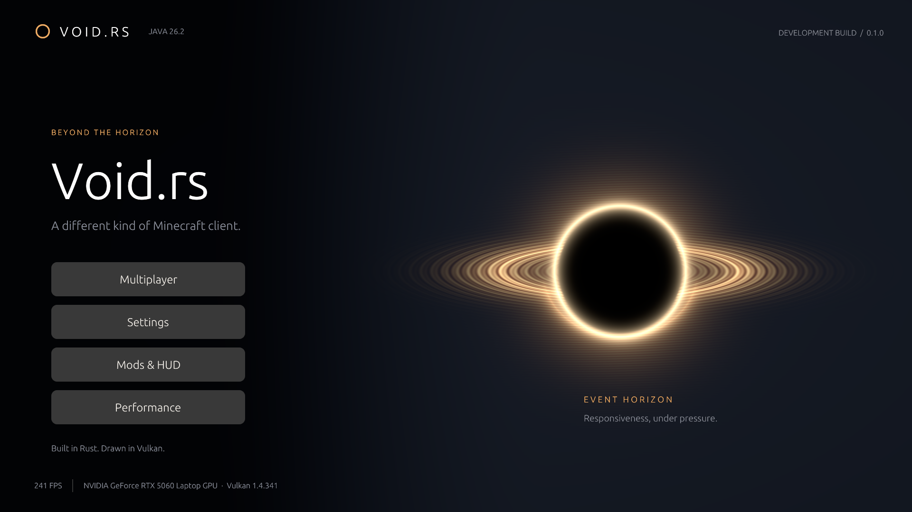

# Void.rs

A standalone Rust Minecraft Java 26.2 client, built around Bevy ECS and a direct Vulkan renderer. Black-hole menus, TOML configuration, and an experimental frame scheduler called **Event Horizon**.

**Development build. This is not a complete Minecraft replacement yet.** The independent protocol, windowed Vulkan application, server-terrain inspection, restricted movement, mod runtimes, and launcher are implemented. Vanilla visual/gameplay parity remains substantial work. Event Horizon has no proven performance advantage yet. See [status and limitations](docs/STATUS.md).



## Build and run

Requires Rust 1.98.1 and a Vulkan 1.4 GPU/driver. Shaders compile from GLSL to SPIR-V during Cargo builds; a separate shader compiler is unnecessary. Gameplay does not use a JVM. Java is needed only for optional reference-data generation/test servers.

```sh
cargo build --release -p void-client -p void-launcher
cargo run --release -p void-client
```

For Linux, install the development packages for DBus, XKB, X11 and Wayland (the CI workflow lists Ubuntu packages). Windows is the initial locally verified platform; Linux execution requires separate verification.

The graphical client creates its configuration in the platform configuration directory. To keep a development profile local:

```sh
cargo run --release -p void-client -- --config .local/client.toml
```

The **Multiplayer** screen can query server status and connect to a 26.2 test server. Sign-in uses your own registered Microsoft application; [account setup](docs/ACCOUNTS.md) describes it. Offline identities work only on servers configured to allow them.

```sh
cargo run --release -p void-client -- --status localhost:25565
cargo run --release -p void-client -- --connect localhost:25565 --username VoidPlayer
```

The current terrain view uses diagnostic geometry/colors, not full vanilla resource rendering. Walking/jumping supports a documented dry-land subset; avoid treating it as validated competitive gameplay.

## TOML and mods

[config/default.toml](config/default.toml) documents the configuration surface: graphics, pacing, experimental scheduling, controls, accounts metadata, HUD positions, and theme options. Safe edits reload while running; settings needing restart are identified. Secrets never belong in TOML.

Build Rust mods as portable Wasm modules or trusted platform-specific native libraries. Both use [void-sdk](crates/void-sdk). The included metrics module uses the same HUD contract as external mods. Start with [the mod guide](docs/MODDING.md) and the examples under `examples/mods`.

## Event Horizon

The scheduler admits explicitly deferrable work using independent CPU/GPU estimates, deadlines, bounded memory, aging, fairness, and revision checks. Baseline is the default. Frame coordination lets the event loop keep receiving input while waiting for a busy frame slot. Full Event Horizon additionally schedules mesh uploads and deferrable mod callbacks. Both coordination and background scheduling remain experimental; granular uploads, presentation timing and benchmark qualification are unfinished.

The [algorithm and acceptance gates](docs/EVENT_HORIZON.md) require real rendered A/B evidence. Synthetic tests and menu FPS cannot establish a PvP speedup.

## Validation

The [local validation report](docs/VALIDATION.md) records the executed checks, framebuffer captures, hardware, and outstanding release gates.

```sh
cargo fmt --all --check
cargo clippy --workspace --all-targets -- -D warnings
cargo test --workspace
cargo run --release -p void-client -- --smoke-frames 120 --screenshot .local/menu.png --metrics .local/frames.json
```

Screenshot output is captured from the actual Vulkan framebuffer. Measurements distinguish CPU duration, GPU timestamps, and input-event-to-submission timing; none is a substitute for external input-to-photon measurement.

See [architecture](docs/ARCHITECTURE.md), [implementation plan](docs/PLAN.md), [protocol provenance](docs/PROTOCOL.md), [physics limits](docs/PHYSICS.md), [renderer contract](docs/RENDERING.md), and [launcher/update setup](docs/LAUNCHER.md).

MIT-licensed project code. Minecraft assets, server binaries, account credentials, and signing keys are not distributed in this repository. This project is independent of Mojang and Microsoft.
